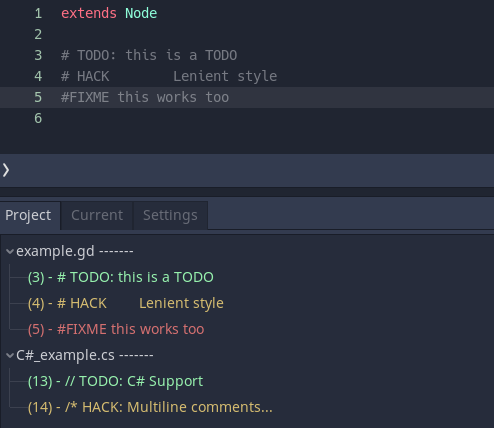
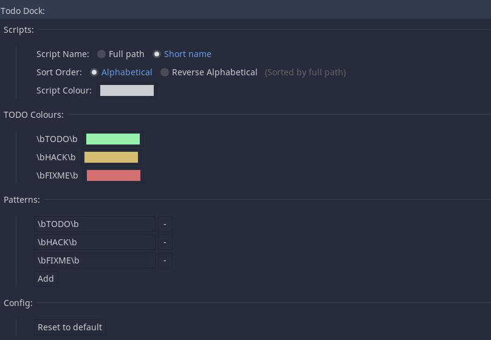
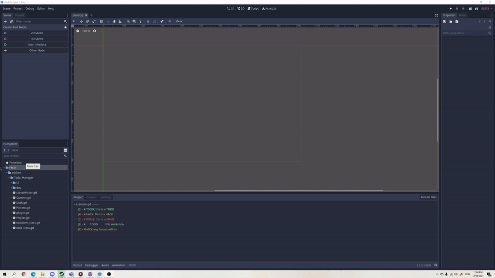
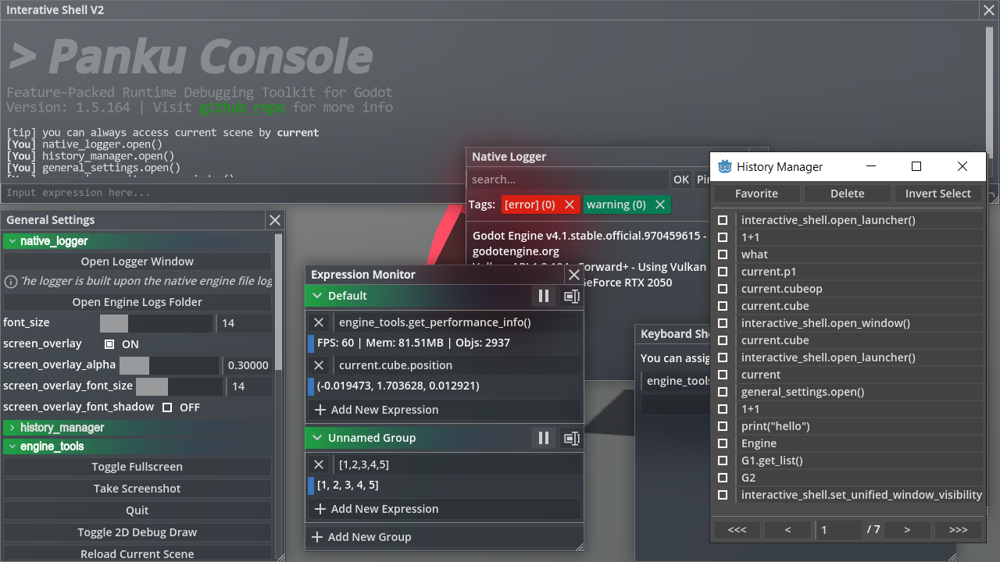
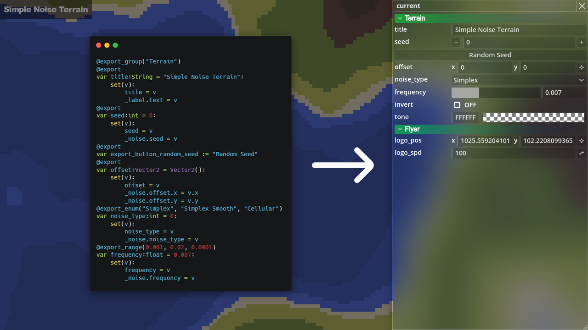
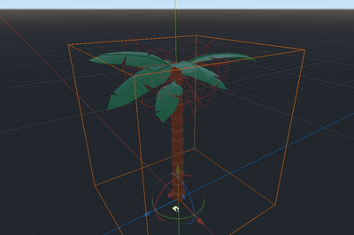
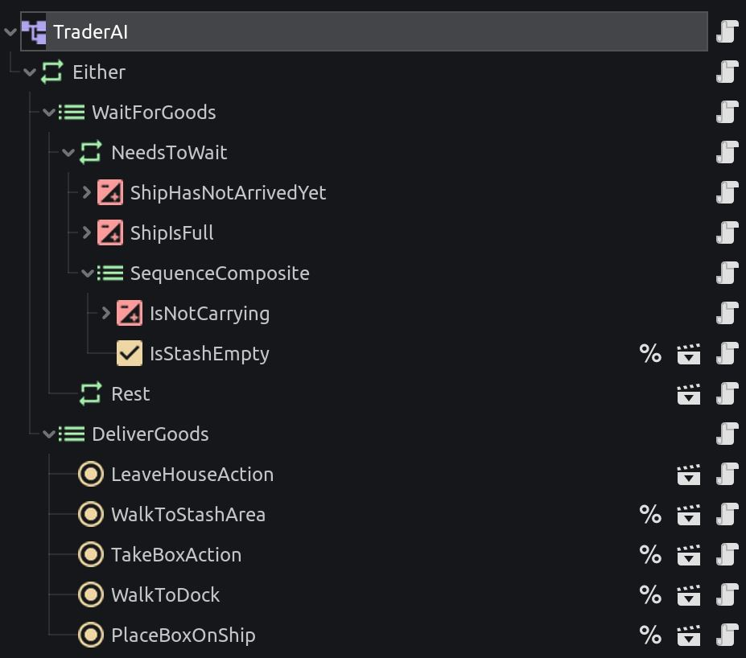

# 5 крутих плагінів в Godot, що допоможуть на джемі

А) Godot рушій з кожним днем стає популярним, але він ще не production ready для великих проєктів. Але в інді вже виходить досить багато якісних продуктів. Хочу розказати секрет як їм вдалося зробити приємними та не зайняло багато часу. Це підбірка 5 корисних плагінів для користувачів Godot.

В) Godot рушій з кожним днем стає популярним. На жаль, він не має багато функціонала, який би хотілося бачити з коробки, але велика та активна спільнота допомагає покрити ці проблеми. В цій статі хочу поділитися 5 корисними плагінами для Godot, які раджу спробувати й вам. Вони всі безкоштовні та можна завантажити з Godot Asset Library

C) Godot рушій з кожним днем стає популярним. На жаль, він не має багато функціонала, який би хотілося бачити з коробки, але велика та активна спільнота допомагає покрити ці проблеми. Ми зібрали вам підбірку крутих і цікавих плагінів на Годот! Вони не лише дозволять спростити процес ігроваріння, а й додати реалістичності та розуму вашим іграм! Вони всі безкоштовні та можна завантажити з Godot Asset Library

## [Quake BSP Importer](https://godotengine.org/asset-library/asset/2147) та [Qodot](https://godotengine.org/asset-library/asset/1631)
Знаєте, створення рівнів вбудованими інструментами Годот потребує багато часу та нервів, бо він не має такої хорошої системи як BSP. Ось тому вам на допомогу приходять одразу два плагіни: [Quake BSP Importer](https://godotengine.org/asset-library/asset/2147) та [Qodot](https://godotengine.org/asset-library/asset/1631)! Ці плагіни дозволять імпортувати створені вами прототипи рівнів з програми TrenchBroom (яка використовується для рушія Quake) прямо у Godot! Різниці між цими двома плагінами фактично немає, окрім імпортування різного формату файлів та текстур з TrenchBroom, тому вони разом у цьому пункті, але мені особисто більше подобається **Qodot**, який існує ще з Godot 3 та працює стабільніше і зручніше.

Дані плагіни дозволяють дуже швидко створювати прототипи рівнів, які не обов'язково оптимізувати пізніше, особливо під час джему 🙃 По стилю вони будуть схожі ближче до quake, тому може підійти в кінці не всіх, але створювати рівні у програмі TrenchBroom лише одне задоволення. Демо як це відбувається гарно продемонстровано у відео

## [TODO Manager](https://godotengine.org/asset-library/asset/1327)
Як то кажуть, чистота – запорука здоров’я. Ментального. Програміста. І саме тут у нагоді може стати плагін [TODO Manager](https://godotengine.org/asset-library/asset/1327)! Фактично це Todoist, інтегрований у ваш код. Він дозволяє перетворити коментар у задачу або зручно зробити собі помітку на майбутнє, щоб не забути. І одним помахом чарівної палички ці всі коментарі будуть структуровані та відображені у панелі внизу.

Є стандартні коментарі такі як TODO, FIXME, HACK, але можна ще додати власні. Також для кожного коментаря можна налаштувати колір.

Дуже зручний асет, який значно полегшить роботу з кодом! Особливо після довгої важкої роботи ви прокидаєтеся зранку і все забули що хотіли ще доробити чи де треба було щось виправити, а з даними коментарями це вже в минулому

## [Panku Console](https://godotengine.org/asset-library/asset/1558)
Debug. Debug ніколи не змінюється… Це дуже неприємний процес, який вимагає стійкості та витривалості. Але ви можете зробити цей процес більш приємним за допомогою [Panku Console](https://godotengine.org/asset-library/asset/1558)! Це буде, нарешті, щось схоже на Half life. Всі ж бавились в дитинстві з консольними командами? Асет створює консоль прямо у грі, за допомогою якої можна буде керувати ігровим процесом чи візуально зручно показати важливо інформацію у грі.

Типово є декілька команд, але можна додавати власні, що також робиться за допомогою кількох кліків. Крім того, є й інші налаштовувані вікна для швидкої візуалізації того що твориться всередині.

## [WiggleBone](https://godotengine.org/asset-library/asset/1329)
Уявімо, що вам треба налаштувати фізику для об’єктів у грі. [WiggleBone](https://godotengine.org/asset-library/asset/1329) додає режим желе для кісток при русі. Використання у цього плагіну доволі широке. Хтось за допомогою цього створює фізику волосся чи тіла загалом, а хтось це використовує для анімації води. Застосувань безліч, цікаво буде поглянути ваші 😉

## [Phantom Camera](https://godotengine.org/asset-library/asset/1822)
Нативна камера у Godot реалізована досить добре і є достатньо базового функціонала, але інколи не вистачає достатньої зручності, як побачити в окремому вікні куди камера дивиться, поставити межі слідкування за персонажем та багато іншого, що може запропонувати плагін [Phantom Camera](https://godotengine.org/asset-library/asset/1822)! 

<table>
    <thead>
        <tr>
            <th align="center" valign="top">
              
               
              <b>2D</b>
            </th>
            <th align="center" valign="top">
              
               
              <b>3D</b>
            </th>
        </tr>
    </thead>
    <tr>
        <td align="center">      
            <video src="https://github.com/ramokz/phantom-camera/assets/5159399/a887a603-b95f-474e-9141-b451ac6a8d91"/> 
        </td>
        <td align="center">
            <video src="https://github.com/ramokz/phantom-camera/assets/5159399/ff091b27-bdbb-4115-a3f2-939a24b2b6de"/>
        </td>
    </tr>
</table>

Крім того, що було описано вище, містить також плавні анімації, слідкування одночасно за більше ніж двома гравцями на одному екрані, хорошу документацію та багато іншого. Якщо хтось користувався Unity, то він чимось схожий до асету Cinemachine. Це швидко прискорить робити ігри різних жанрів з різними типами камер, як це можна побачити у демо сценах

<video src="https://github.com/ramokz/phantom-camera/assets/5159399/2a900def-4a8b-46c2-976c-b8e66feec953"/>

## [Beehave](https://godotengine.org/asset-library/asset/1349)
Мрієте про повстання штучного інтелекту? Тепер з плагіном [Beehave](https://godotengine.org/asset-library/asset/1349) ви можете створити для гравців сценарій, у якому ШІ дійсно може кинути виклик! Звісно це все можна зробити вручну, але з даним асетом це зробити в рази легше і з “чистішим” кодом. Цей плагін використовує структуру Behavior tree в якій створюється певне завдання, яке має виконувати, наприклад робот. Ця структура за заданих умов допоможе визначити яке завдання передати на виконання. На фотографії нижче можна побачити приклад використання плагіну у вигляді Node, функціоналу Godot.

Ще інколи замість даної системи для штучного інтелекту використовують state machine. Вона теж підходить, але для легших задач, де не має багато логіки. Адже складніша логіка плодить все більше перехресних зв’язків, яка буде важче читатись. От, наприклад ви можете бачити на зображенні як буде виглядати state machine, коли додати багато зв’язків

Не читабельно правда? А от якщо реалізувати через behaviour tree

Крім того, що це легше читається, він має більше функціоналу вибору задач як Selector чи Sequence. Розказувати можна довго про ці два методи створення AI, що тягне на окрему статтю 😉

## [JamCountdown](https://godotengine.org/asset-library/asset/1610)
Хочу розказати вам про ще один плагін як бонус 😏 Він дуже простенький, але на джемі сильно допомагає. Це відлік до закінчення джему. Виставляємо час, коли джем закінчується і зверху у правому кутку з’явиться великий таймер, ви його не пропустите 😊 І тепер не треба більше скакати між програмами та вкладками, щоб подивитися скільки ще часу залишилося 😉

## Заключення
Для Годо є ще багато корисних плагінів. Насправді левова частка з них заслуговують уваги. А з виходом Godot 4.0 якісних плагінів стало в рази більше. А от що буде далі?! Сподіваємось Godot реалізує магазин для продажу асетів. Контриб'ютори на гітхабі давно просять про таку функцію і навіть створили обговорення, в якому ви можете написати свою думку. Також вже є інформація, що створили сторінки в соцмережах з Godot Asset Store, тож чекаємо поки буде офіційний анонс сайту 🫡 Якщо вам сподобалася така рубрика і хотіли б більше бачити такі підбірки, то дайте знати. А також приєднуйтеся до спільноти Ігровари 🥰 І пам’ятайте, що варити ігри разом веселіше!